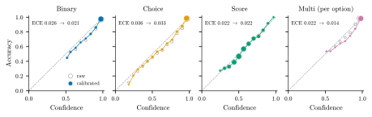
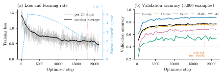
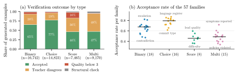

#  WaterSheep

Calibrated decisions for any text.

[](LICENSE)
[](https://huggingface.co/samratduttaofficial/WaterSheep)
[](https://huggingface.co/spaces/samratduttaofficial/WaterSheep)

[Website](https://samratduttaofficial.github.io/WaterSheep/) ·
[Demo](https://huggingface.co/spaces/samratduttaofficial/WaterSheep) ·
[Model](https://huggingface.co/samratduttaofficial/WaterSheep)

WaterSheep answers yes/no, single-choice, rating and multi-label questions about any text, with a
probability for every option.

## Usage

```bash
pip install transformers torch
```

```python
from transformers import pipeline

ws = pipeline(model="samratduttaofficial/WaterSheep", trust_remote_code=True)
ws("I was charged twice.", question="Which team should handle this?", options=["billing", "shipping", "support"])
```

| Type | Options | Answer |
|---|---|---|
| `noul` | none (yes/no) | probability of yes |
| `choice` | any labels | the best option |
| `score` | a digit scale, e.g. `1` to `5` | the expected level |
| `multi` | any labels, with `type="multi"` | every option above the threshold |

Every answer includes a probability for each option.

## Using Jev?

WaterSheep is an open-source alternative to Jev. Run it as a local server:

```bash
pip install git+https://github.com/SamratDuttaOfficial/WaterSheep
watersheep --model samratduttaofficial/WaterSheep --serve
```

It answers Jev's `POST /v1/systemone` requests on your machine, and TypeSafe's Python SDK works against it
without code changes:

```bash
export TYPESAFE_BASE_URL=http://127.0.0.1:8766
```

Any API key value works locally. Multi-label questions (`"type": "multi"`) work too, as plain JSON.
WaterSheep is independent and not affiliated with TypeSafe AI.

## Download

```bash
hf download samratduttaofficial/WaterSheep --local-dir WaterSheep
```

Or with Git (requires [Git LFS](https://git-lfs.com)):

```bash
git clone https://huggingface.co/samratduttaofficial/WaterSheep
```

Then load it from the folder, offline:

```python
ws = pipeline(model="WaterSheep", trust_remote_code=True)
```

## API

Deploy it as a Hugging Face [Inference Endpoint](https://endpoints.huggingface.co), then:

```bash
curl https://YOUR-ENDPOINT -H "Authorization: Bearer $HF_TOKEN" -H "Content-Type: application/json" -d '{"inputs": "I was charged twice.", "parameters": {"question": "Which team should handle this?", "options": ["billing", "shipping", "support"]}}'
```

## JavaScript

No install; runs in the browser:

```html
<script type="module">
  import { decide } from "https://samratduttaofficial.github.io/WaterSheep/watersheep.js";
  console.log(await decide("I was charged twice.", "Which team should handle this?", ["billing", "shipping", "support"]));
</script>
```

With a downloaded copy on your web server, call `load({ base: "WaterSheep/" })` first.

Other languages: run `onnx/model_quantized.onnx` with ONNX Runtime; `watersheep.js` shows the input format.

## Python package

```bash
pip install git+https://github.com/SamratDuttaOfficial/WaterSheep
```

```python
from watersheep import WaterSheep

ws = WaterSheep.load("samratduttaofficial/WaterSheep")
ws.decide("I was charged twice.", "Which team should handle this?", ["billing", "shipping", "support"])
```

`decide` returns the answer, its confidence and a probability for every option. `ask` answers several
questions about one text:

```python
ws.ask({
    "state": {"customer": "Priya (premium plan)",
              "message": "Charged twice for order #4411 and the package is 12 days late."},
    "questions": {
        "escalate": {"type": "noul", "instructions": "Should a human agent take over now?"},
        "team": {"type": "choice", "instructions": "Which team should handle this?",
                 "criteria": {"billing": "payments, refunds", "shipping": "delivery problems"}},
        "frustration": {"type": "score", "instructions": "How frustrated is the customer?",
                        "criteria": ["calm", "annoyed", "frustrated", "furious"]},
        "issues": {"type": "multi", "instructions": "Which issues are reported?",
                   "criteria": ["double charge", "late delivery", "damaged item"]},
    },
})
```

| Type | Question | Answer |
|---|---|---|
| `noul` | yes/no | probability of yes |
| `choice` | single choice | the option, with a probability for each |
| `score` | rating scale | the expected level, with a probability for each |
| `multi` | multi-label | every option above the threshold, with probabilities |

Command line:

```bash
watersheep --model samratduttaofficial/WaterSheep --question "Which team should handle this?" --options billing,shipping,support --state "I was charged twice."
```

`--serve` runs a local HTTP API on port 8766.

## Evaluation

| Evaluation | Accuracy | ECE |
|---|---|---|
| In-distribution test split | 77.8% | 0.026 |
| Held-out datasets, not seen in training | 61.2% | 0.043 |

ECE is the expected calibration error (lower is better).



Accuracy against confidence for each question type, before (raw) and after calibration.

### Benchmarks

| Benchmark | Suite | Questions | Accuracy | ECE | In training data |
|---|---|---|---|---|---|
| [goemotions](https://huggingface.co/datasets/google-research-datasets/go_emotions) | sentiment | 2000 | 22.4% | 0.023 | other split |
| [hatecheck](https://huggingface.co/datasets/Paul/hatecheck) | safety | 2000 | 75.1% | 0.139 | no |
| [legal_abercrombie](https://huggingface.co/datasets/nguha/legalbench) | legal | 95 | 21.1% | 0.316 | no |
| [legal_contract_nli_confidentiality_of_agreement](https://huggingface.co/datasets/nguha/legalbench) | legal | 82 | 69.5% | 0.177 | no |
| [legal_corporate_lobbying](https://huggingface.co/datasets/nguha/legalbench) | legal | 490 | 68.4% | 0.216 | no |
| [legal_cuad_audit_rights](https://huggingface.co/datasets/nguha/legalbench) | legal | 1216 | 86.3% | 0.041 | no |
| [legal_definition_classification](https://huggingface.co/datasets/nguha/legalbench) | legal | 1337 | 56.9% | 0.279 | no |
| [legal_function_of_decision_section](https://huggingface.co/datasets/nguha/legalbench) | legal | 367 | 24.3% | 0.245 | no |
| [legal_hearsay](https://huggingface.co/datasets/nguha/legalbench) | legal | 94 | 56.4% | 0.307 | no |
| [legal_overruling](https://huggingface.co/datasets/nguha/legalbench) | legal | 2000 | 62.5% | 0.151 | no |
| [legal_personal_jurisdiction](https://huggingface.co/datasets/nguha/legalbench) | legal | 50 | 50.0% | 0.160 | no |
| [legal_privacy_policy_qa](https://huggingface.co/datasets/nguha/legalbench) | legal | 2000 | 58.9% | 0.274 | no |
| [legal_proa](https://huggingface.co/datasets/nguha/legalbench) | legal | 95 | 51.6% | 0.379 | no |
| [legal_ucc_v_common_law](https://huggingface.co/datasets/nguha/legalbench) | legal | 94 | 62.8% | 0.171 | no |
| [prompt_injection](https://huggingface.co/datasets/deepset/prompt-injections) | safety | 116 | 91.4% | 0.079 | other split |
| [xstest](https://huggingface.co/datasets/Paul/XSTest) | safety | 450 | 73.6% | 0.140 | no |

## Training

- Base model: [answerdotai/ModernBERT-base](https://huggingface.co/answerdotai/ModernBERT-base), fine-tuned with a decision head.
- Data: openly licensed public datasets (listed in [NOTICE](NOTICE)) and synthetic decisions from Qwen3.5-4B.
- Calibration: a temperature per question type, fitted on a validation split.



Training loss and learning rate (left); validation accuracy by question type (right).



Share of synthetic examples kept after verification, by question type (left) and by family (right).

## Limitations

- English only.
- Long inputs are truncated.
- Rating-scale answers are less accurate than the other types.
- Probabilities are calibrated on data like the training data; validate them on your own.
- Not for high-stakes decisions (medical, legal, financial, hiring) on its own.

## Train a new model

```bash
git clone https://github.com/SamratDuttaOfficial/WaterSheep
cd WaterSheep
./scripts/run.sh
```

Use `scripts\run.bat` on Windows.

### Results

The figures, tables and data are in [`results/`](results). To remake them after training and
`scripts/run-benchmarks.sh` (`.bat` on Windows), run these from the project root with the Python in `.venv`:

| Script | Needs | Writes to `results/` |
|---|---|---|
| `tools/results/data_stats.py` | a trained model | `data/data_stats.json` |
| `tools/results/make_figures.py` | `data_stats.py`, benchmarks | `figures/`, `data/synth_outcomes_by_type.json` |
| `tools/results/gen_tables.py` | `data_stats.py` | `tables/sources.tex`, `tables/families.tex` |
| `tools/results/bench_table.py` | benchmarks | `tables/bench.tex`, `tables/speed.tex`, `data/bench_summary.json` |

Each uses the newest model unless `--model` is given.

## License

Apache 2.0 ([LICENSE](LICENSE)). Attributions: [NOTICE](NOTICE).

## Citation

```bibtex
@misc{watersheep,
  author = {Samrat Dutta},
  title  = {WaterSheep: calibrated decisions for any text},
  year   = {2026},
  url    = {https://huggingface.co/samratduttaofficial/WaterSheep}
}
```

---

<p align="center">
  <a href="https://doi.org/10.13140/RG.2.2.28606.45122"></a>
  <a href="https://buymeacoffee.com/samratdutta"></a>
</p>
